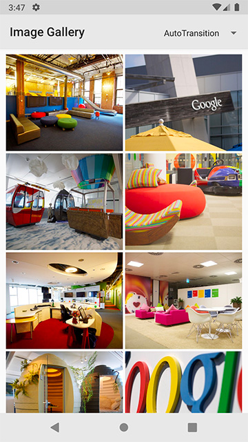
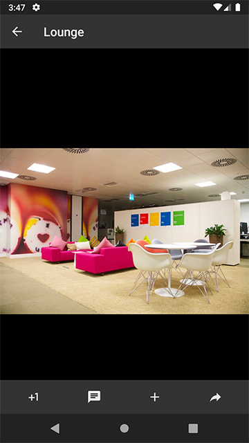

Example of shared element transitions in Android.

Code used within the example based on the #io16 session ["A window into transitions"](https://events.google.com/io2016/schedule?sid=642d2aeb-0bef-e511-a517-00155d5066d7#day3/642d2aeb-0bef-e511-a517-00155d5066d7).

## Screenshots (v2)

| Image gallery | Detail pager |
| --- | --- |
|  |  |
